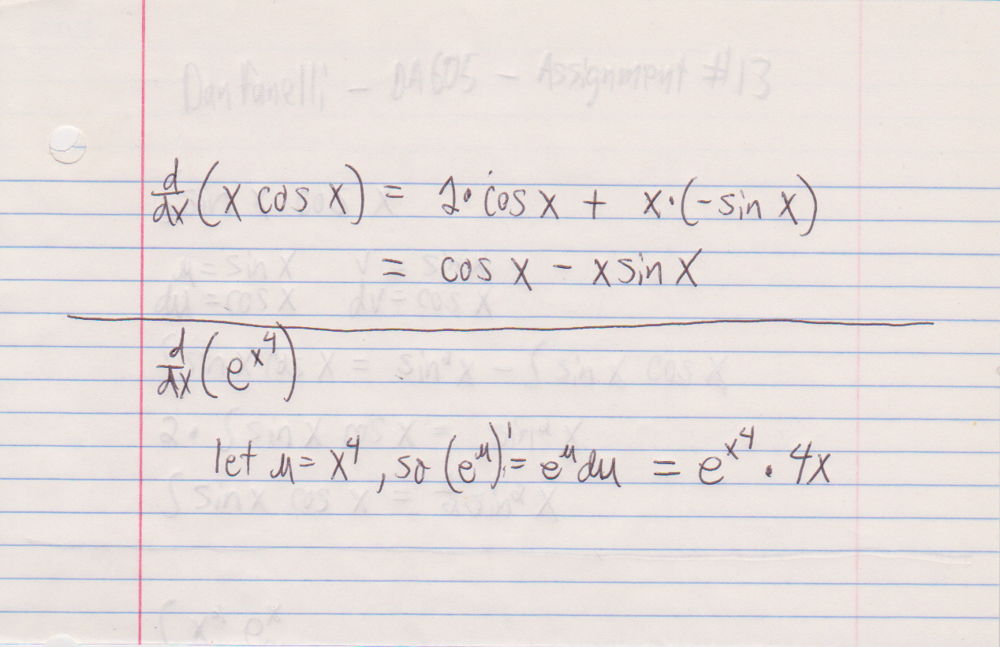

## NUMERICAL INTEGRATION AND DIFFERENTIATION

* Write a program to compute the derivative of f(x) = x^3 + 2x^2 at any value of x. 
* Your function should take in a value of x and return back an approximation to the derivative of f(x) evaluated at that value. 
* You should not use the analytical form of the derivative to compute it. * Instead, you should compute this approximation using limits.

```{r message=FALSE, warning=FALSE}
library(boot)

deriv_at <- function(x0){
  func_value_1 <- function(x){
    return (x * x * x + 2 * x * x)
  }
  y0 <- func_value_1(x0)
  x1 <- x0 + 0.0000001
  y1 <- func_value_1(x1)
  value <- (y1-y0)/(x1-x0)
  return (value)
}

```

### Test our Derivatives:

in our heads, we work out the deriv to 3x^2 + 4x...so:

```{r message=FALSE, warning=FALSE}
# at 2 it should be 20..
deriv_at(2)
# at 4 it should be 64..
deriv_at(4)
# at -1 it should be -1..
deriv_at(-1)
# at 0 it should be 0..
deriv_at(0)
```

* Now, write a program to compute the area under the curve for the function 3x^2+4x in the range x = [1, 3]. 
* You should first split the range into many small intervals using some really small delta-x value (say 1e-6) and then compute the approximation
to the area under the curve.


```{r message=FALSE, warning=FALSE}
integral_of <- function(x_left, x_right){
  func_value_2 <- function(x){
    return (3 * x * x + 4 * x)
  }
  num_blocks <- 1000
  block_width <- (x_right - x_left) / num_blocks
  # go from left to right-1 (left sum)
  x_list <- seq(from = x_left, to = (x_right-block_width), by = block_width)
  block_heights <- func_value_2(x_list)
  
  return (block_width * sum(block_heights))
}

integral_of(1, 3)
# which checks out by hand - ie - 42 is the exact value...
```

### Scanned Problems:



